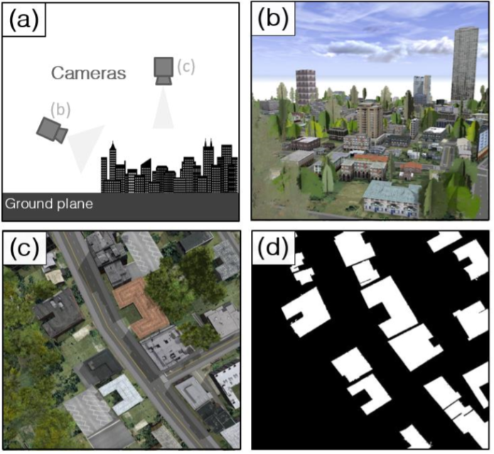
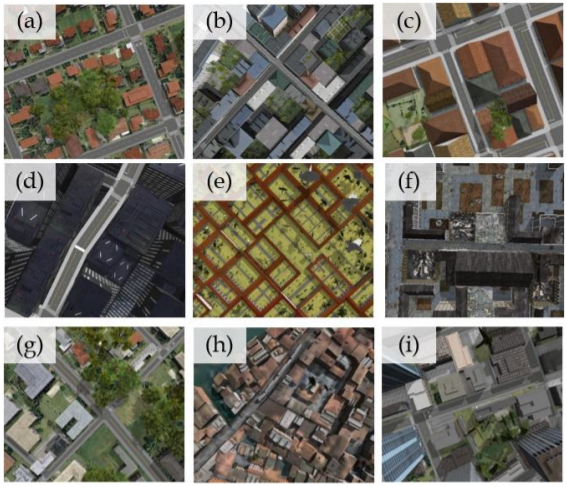

# Overview
In this work we develop an approach to rapidly and cheaply generate large and diverse synthetic overhead imagery for training segmentation CNNs with CityEngine.  Using this approach, we generate and release a collection of synthetic overhead imagery, termed Synthinel-1, with full pixel-wise building labels.  We use several benchmark datasets to demonstrate that Synthinel-1 is consistently beneficial when used to augment real-world training imagery, especially when CNNs are tested on novel geographic locations or conditions.  

    <em>Fig 1. </em>

We summarized our work to paper "[The Synthinel-1 dataset: a collection of high resolution synthetic overhead imagery for building segmentation](https://arxiv.org/abs/2001.05130)" .

Synthinel-1 is now publicly released. Please download the dataset [here](https://drive.google.com/open?id=1T2fO-VLfyQoQdy5C4at_uHkP0KBRZkit).

## About Synthinel
Synthinel is a collection of synthetic overhead imagery for building segmentation, with pixel-wise ground truth. The dataset is extracted from CityEngine.

### Examples

### Dependencies

The dependencies to run the codes are 

* CityEngine 2019.0

### Third-Party Software
CityEngine used by Synthinel is a tool for rapidly generating large-scale virtual urban scenes. 

Research
---------

If you find our work is helpful for your research, we would very appreciate if you cite our paper.

    @inproceedings{synthinel2020,
        title={The Synthinel-1 dataset: a collection of high resolution synthetic overhead imagery for building segmentation},
        author={Fanjie Kong, Bohao Huang, Kyle Bradbury, Jordan Malof},
        booktitle={2020 Winter Conference on Applications of Computer Vision (WACV)},
        year={2020}
    }
    
    
   
### Research Logs

- Find some ground truths are not aligned with objects well. This is caused by the light variations in images for extracting ground truths. This can be fixed by changing the light angle to 90 degree and light intensity to 1 when shooting the images used for extracting ground truths.
